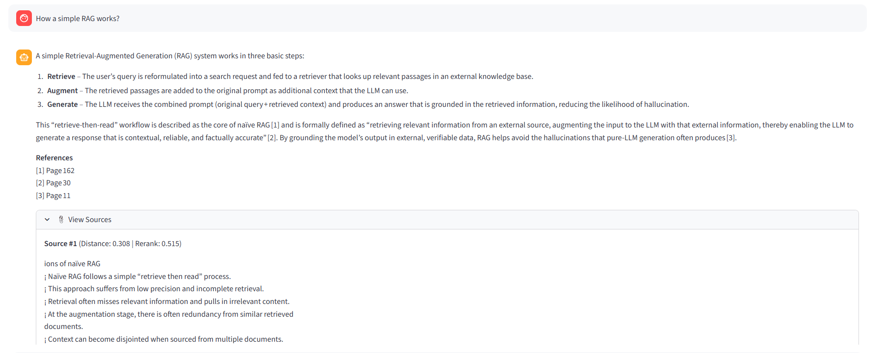

# 📚 Book RAG - Advanced Multi-Book Question-Answering System

A powerful, standalone Python-based RAG (Retrieval-Augmented Generation) system for intelligent conversations with your PDF books. Built with local embeddings, persistent vector storage, advanced retrieval techniques, and streaming LLM responses.


## ✨ Features

### 📚 **Multi-Book Support with Book-Specific Intelligence**
- Support for multiple PDF books simultaneously
- Book-specific prompts tailored to each document's domain
- Optimized for technical guides and business books
- Dynamic prompt adaptation based on selected books

### 🔍 **Advanced Retrieval System**
- **Three Retrieval Strategies**: Direct search, HyDE (Hypothetical Document Embeddings), and Multi-Query
- **Canonical Query Rewriting**: Intent-preserving query reformulation optimized for each book's terminology
- **Cross-Encoder Reranking**: BAAI/bge-reranker-v2-m3 for superior result relevance
- **Top-10 Retrieval**: Comprehensive context gathering with automatic deduplication

### 🧠 **Local Embeddings & GPU Acceleration**
- BAAI/bge-base-en-v1.5 embeddings (768 dimensions)
- Auto-detect CUDA/MPS GPU acceleration
- Persistent ChromaDB vector storage

### 💬 **Modern Chat Experience**
- **Real-time streaming responses** with word-by-word generation
- Clean Streamlit interface with animated elements
- Conversation history with full source attribution
- Dual scoring display (distance + rerank scores)



### 🤖 **Flexible LLM Integration**
- OpenRouter API with support for any model
- Streaming support for immediate feedback
- Book-specific system prompts for optimal answers
- Inline citations with comprehensive references

## 🏗️ Architecture

```
┌──────────────────────────────────────────────────────────┐
│               Streamlit UI (app.py)                      │
│  - Real-time streaming chat interface                   │
│  - Multi-book selection with checkboxes                 │
│  - Retrieval mode selector (None/HyDE/Multi-Query)      │
│  - Lottie animations for visual feedback                │
│  - API configuration sidebar                            │
└────────────────┬─────────────────────────────────────────┘
                 │
┌────────────────▼─────────────────────────────────────────┐
│              RAG Backend (rag_backend.py)                │
│  - PDF text extraction & advanced cleaning               │
│  - Text chunking (500 chars, 50 overlap)                 │
│  - GPU-accelerated embeddings (BAAI/bge-base-en-v1.5)    │
│  - Book-specific query rewriting (HyDE/Multi-Query)      │
│  - ChromaDB vector storage & retrieval (top-10)          │
│  - Cross-encoder reranking (bge-reranker-v2-m3)          │
│  - Streaming OpenRouter LLM with book-specific prompts   │
│  - Dynamic prompt adaptation per book                    │
└────────────────┬─────────────────────────────────────────┘
                 │
┌────────────────▼─────────────────────────────────────────┐
│            Preprocessing (preprocess_pdf.py)             │
│  - Batch PDF processing with GPU support                │
│  - Friendly display name generation                     │
│  - Detailed logging with progress tracking              │
│  - Statistics tracking and validation                   │
└──────────────────────────────────────────────────────────┘
```

## 🚀 Quick Start

### Prerequisites

- Python 3.12+ (recommended)
- OpenRouter API key ([get one here](https://openrouter.ai/))
- 4GB+ RAM for embedding model

### Installation

1. **Clone the repository**:
```bash
git clone https://github.com/dataelvisliang/Book-RAG.git
cd Book-RAG/pdf-rag
```

2. **Install dependencies**:
```bash
pip install -r requirements.txt
```

3. **Preprocess your PDFs**:
```bash
# Process PDFs from default "sample book" folder
python3.12 preprocess_pdf.py

# Or specify a custom folder/file
python3.12 preprocess_pdf.py /path/to/pdfs
python3.12 preprocess_pdf.py /path/to/document.pdf

# With custom database path and model
python3.12 preprocess_pdf.py --db-path ./my_db --model BAAI/bge-base-en-v1.5
```

4. **Run the Streamlit app**:
```bash
# Using the run script
./run.sh

# Or directly
python3.12 -m streamlit run app.py
```

5. **Open your browser** at `http://localhost:8501`

## 📖 Usage

### Preprocessing PDFs

The preprocessing script processes PDFs and stores embeddings in ChromaDB:

```bash
python3.12 preprocess_pdf.py [pdf_path] [--db-path PATH] [--model MODEL]
```

**What it does**:
- Extracts text from PDFs page by page
- Splits text into 500-character chunks with 50-character overlap
- Generates 768-dimensional embeddings using BAAI/bge-base-en-v1.5
- Stores embeddings in ChromaDB with metadata (page numbers, chunk IDs)
- Creates detailed logs in `./logs/` directory

**Example output**:
```
============================================================
📄 Processing: data science for business.pdf
============================================================
📖 Extracting text from PDF...
   ✓ Extracted 395 pages

📊 Chunking Statistics:
   • Chunk size: 500 characters
   • Overlap: 50 characters
   • Total chunks: 2155
   • Avg chunks per page: 5.5
   • Avg characters per page: 2272

🔄 Generating embeddings...
   • Model: BAAI/bge-base-en-v1.5
   • Embedding dimension: 768
   • Processing 2155 chunks in batches...

✅ Successfully processed 395 pages and 2155 chunks
   • Stored in ChromaDB collection: pdf_data_science_for_business_pdf
```

### Using the Streamlit App

1. **Enter your OpenRouter API key** in the sidebar
2. **Select your preferred AI model** (default: nvidia/nemotron-3-nano-30b-a3b:free)
3. **Choose retrieval mode**:
   - **None**: Direct search with original query (fastest)
   - **HyDE**: Generate hypothetical answer for better retrieval (default)
   - **Multi-Query**: Generate 3 query variations for broadest coverage
4. **Select documents** to query from the sidebar checkboxes
5. **Ask questions** in the chat interface
6. **View sources** with both distance and rerank scores by expanding "View Sources"

### Retrieval Modes Explained

#### 🎯 None (Direct Search)
- Searches with your original query as-is
- Fastest option (no API calls for rewriting)
- Best for keyword searches and exact phrases

#### 🔮 HyDE (Hypothetical Document Embeddings)
- Generates a hypothetical answer to your question
- Searches using the answer embedding instead of the question
- Best for conceptual "What is..." queries
- **Default mode** - great for most questions

#### 🌐 Multi-Query (3 Variations)
- Generates 3 query rewrites:
  1. Conceptual (technical terminology)
  2. Business-value (decision-making focus)
  3. Keyword-style (noun-heavy)
- Searches with all 3, combines and deduplicates results
- **Broadest coverage** - ideal for complex or exploratory questions

All modes benefit from **cross-encoder reranking** which re-scores results for better relevance.

## 🛠️ Technical Details

### Embedding Model
- **Model**: BAAI/bge-base-en-v1.5
- **Dimensions**: 768
- **Device**: Auto-detect CUDA (NVIDIA GPU), MPS (Mac GPU), or CPU fallback
- **GPU Support**: Automatically applied to both embedding and reranking models
- **Normalization**: Enabled for BGE models

### Query Rewriting (Book-Specific)
- **HyDE Model**: nvidia/nemotron-3-nano-30b-a3b:free (configurable)
- **HyDE Temperature**: 0.3 (focused, canonical generation)
- **Multi-Query Rewrites**: 3 canonical variations per query
- **Book-Specific Prompts**:
  - Data Science for Business: Data mining terminology, business decision focus, analytical thinking
  - RAG Guide: RAG technical terms, implementation focus, architecture concepts
- **Intent Preservation**: All rewrites maintain original user intent while optimizing for retrieval

### Reranking
- **Model**: BAAI/bge-reranker-v2-m3 (cross-encoder)
- **Purpose**: Re-scores retrieved results for superior relevance
- **Scoring**: Higher rerank score = more relevant (displayed alongside distance)
- **GPU Support**: Auto-detect and use GPU for faster reranking
- **Lazy Loading**: Model loaded on first use to save memory

### Text Processing
- **Chunk Size**: 500 characters
- **Overlap**: 50 characters (10% of chunk size)
- **Cleaning**:
  - Unicode normalization
  - Whitespace normalization (multiple spaces/newlines)
  - Surrogate character removal
  - Tab-to-space conversion
  - Empty line removal

### Vector Database
- **Database**: ChromaDB (local, persistent)
- **Similarity**: Cosine distance (1 - cosine similarity)
- **Top-k Retrieval**: 10 most relevant chunks per query (increased for comprehensive context)
- **Deduplication**: Automatic across multi-query results
- **Collection Metadata**: Stores friendly display names for each book

### LLM Integration with Streaming
- **Provider**: OpenRouter API
- **Default Model**: nvidia/nemotron-3-nano-30b-a3b:free
- **Supported Models**: Any OpenRouter model
  - anthropic/claude-3.5-sonnet
  - openai/gpt-4o
  - google/gemini-pro-1.5
  - meta-llama/llama-3.1-70b-instruct
- **Streaming**: Real-time word-by-word response generation with cursor effect
- **System Prompts**: Book-specific prompts that adapt based on selected books:
  - Data Science for Business: Focuses on business decision-making and analytical thinking
  - RAG Guide: Focuses on system architecture and implementation details
  - Multi-book: Generic prompt for multiple books
- **Context**: Top-10 retrieved + reranked chunks from vector search
- **Temperature**: 0.7
- **Max Tokens**: 1500
- **Citations**: Inline citations [1], [2] with References section

## 📁 Project Structure

```
Book-RAG/
├── app.py                           # Streamlit frontend with retrieval mode selector
├── rag_backend.py                   # Core RAG logic with HyDE/Multi-Query/reranking
├── preprocess_pdf.py                # PDF preprocessing script
├── delete_collections.py            # Utility to delete ChromaDB collections
├── test_hyde.py                     # Testing script for retrieval modes
├── requirements.txt                 # Python dependencies
├── README.md                        # This file
├── HYDE_DESIGN.md                   # HyDE technical documentation
├── MULTI_QUERY_DESIGN.md           # Multi-Query technical documentation
├── QUERY_REWRITING_SUMMARY.md      # User guide for retrieval modes
├── IMPROVEMENTS.md                  # Text cleaning and logging improvements
├── .gitignore                       # Git ignore rules
├── .env                             # Environment variables (gitignored)
├── chroma_db/                       # Vector database (gitignored)
├── logs/                            # Preprocessing logs (gitignored)
└── sample book/                     # Sample PDFs (gitignored)
```

## 🔧 Configuration

### Environment Variables (.env)
```bash
OPENROUTER_API_KEY=your_api_key_here  # Optional, can enter in UI
```

### Preprocessing Options
```bash
python3.12 preprocess_pdf.py --help

Arguments:
  pdf_path              Path to PDF file or directory (default: sample book)
  --db-path PATH        Path to ChromaDB storage (default: ./chroma_db)
  --model MODEL         Embedding model name (default: BAAI/bge-base-en-v1.5)
```

## 📊 Performance

- **Embedding Speed**: ~2-5 chunks/second (depends on hardware)
- **Query Latency**:
  - Direct mode: <1 second for retrieval + reranking
  - HyDE mode: +1-2 seconds for hypothetical doc generation
  - Multi-Query mode: +1-2 seconds for query rewrites
  - LLM response: 2-10 seconds
- **Storage**: ~1MB per 100 chunks (embeddings + metadata)
- **Memory Usage**:
  - Embedding model (bge-base-en-v1.5): ~400MB
  - Reranker model (bge-reranker-v2-m3): ~1.2GB
  - Document chunks: ~500MB per 1000 chunks

### Retrieval Quality Improvements

Based on HyDE and Multi-Query research:
- **HyDE**: 20-40% improvement in retrieval quality for conceptual queries
- **Multi-Query**: 30-50% broader coverage, captures different query perspectives
- **Reranking**: 15-30% improvement in result relevance ordering
- **Combined**: Significantly better results than baseline vector search

## 🎯 Roadmap

### ✅ Completed Features
- [x] Cross-encoder reranking for superior retrieval accuracy
- [x] Query rewriting with HyDE and Multi-Query strategies
- [x] Book-specific canonical query rewrites
- [x] Enhanced text cleaning and preprocessing
- [x] GPU acceleration for embeddings and reranking
- [x] Multi-book support with dynamic prompt adaptation
- [x] Streaming LLM responses with real-time feedback
- [x] Top-10 retrieval for comprehensive context
- [x] Lottie animations for modern UI
- [x] Inline citations with reference tracking
- [x] Dual scoring display (distance + rerank)

### 🚧 Future Enhancements
- [ ] Support for multiple embedding models
- [ ] Hybrid search (dense + sparse retrieval)
- [ ] Document versioning and updates
- [ ] Conversation memory and context tracking
- [ ] Export chat history to markdown/PDF
- [ ] Batch question answering
- [ ] Custom book prompt templates
- [ ] Advanced filtering by page ranges

## 📝 License

This project is licensed under the MIT License - see the LICENSE file for details.

## 🙏 Acknowledgments

- **BAAI** for the bge-base-en-v1.5 embedding model
- **ChromaDB** for the vector database
- **Sentence Transformers** for the embedding framework
- **Streamlit** for the web framework
- **OpenRouter** for LLM API access

## 🤝 Contributing

Contributions are welcome! Please feel free to submit a Pull Request.

---

**Built with ❤️ using Python, ChromaDB, and OpenRouter**
